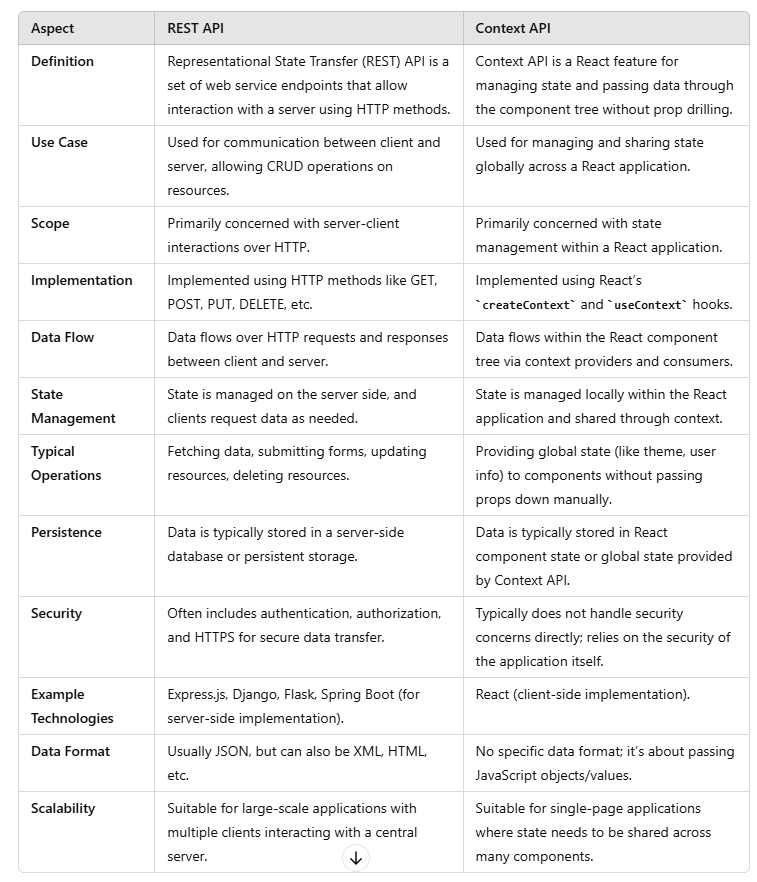

  

<table>
  <tr>
    <th>Type</th>
    <th>Characteristics</th>
    <th>Common Protocols</th>
    <th>Data Formats</th>
    <th>Security</th>
    <th>Use Cases</th>
    <th>Examples</th>
  </tr>
  <tr>
    <td colspan="7" style="text-align: center;"><b># Based on Protocol/Architecture</b></td>
  </tr>
  <tr>
    <td>REST API</td>
    <td>Stateless, resource-based, uses standard HTTP methods</td>
    <td>HTTP/HTTPS</td>
    <td>JSON, XML, HTML</td>
    <td>OAuth, API keys, JWT, HTTPS</td>
    <td>Web services, mobile apps</td>
    <td>GitHub API, Twitter API, Google Maps API</td>
  </tr>
  <tr>
    <td>SOAP API</td>
    <td>Protocol-based, uses XML, operates over multiple protocols</td>
    <td>HTTP, SMTP, TCP</td>
    <td>XML</td>
    <td>WS-Security, SSL/TLS</td>
    <td>Enterprise web services, financial services</td>
    <td>PayPal API, AWS S3 SOAP API</td>
  </tr>
  <tr>
    <td>GraphQL API</td>
    <td>Query language for APIs, allows clients to request specific data</td>
    <td>HTTP/HTTPS, WebSockets</td>
    <td>JSON</td>
    <td>OAuth, API keys, HTTPS</td>
    <td>Efficient data fetching, real-time updates</td>
    <td>GitHub GraphQL API, Shopify API</td>
  </tr>
  <tr>
    <td>gRPC</td>
    <td>Uses HTTP/2 for transport, Protocol Buffers for serialization</td>
    <td>HTTP/2</td>
    <td>Protocol Buffers</td>
    <td>TLS</td>
    <td>High-performance, low-latency applications</td>
    <td>Google Cloud Pub/Sub, etcd</td>
  </tr>
  <tr>
    <td>WebSockets API</td>
    <td>Full-duplex communication channel over a single, long-lived connection</td>
    <td>HTTP/1.1, HTTP/2</td>
    <td>JSON, XML, custom formats</td>
    <td>WSS (WebSockets Secure)</td>
    <td>Real-time applications, live updates</td>
    <td>Slack API, real-time chat apps</td>
  </tr>
  <tr>
    <td colspan="7" style="text-align: center;"><b># Based on Access Level</b></td>
  </tr>
  <tr>
    <td>Open APIs (Public APIs)</td>
    <td>Publicly available, accessible to external developers</td>
    <td>HTTP/HTTPS</td>
    <td>JSON, XML, CSV</td>
    <td>API keys, OAuth, HTTPS</td>
    <td>Social media integrations, public data services</td>
    <td>Twitter API, OpenWeatherMap API</td>
  </tr>
  <tr>
    <td>Partner APIs</td>
    <td>Shared with specific business partners, restricted access</td>
    <td>HTTP/HTTPS</td>
    <td>JSON, XML, CSV</td>
    <td>OAuth, API keys, HTTPS</td>
    <td>Business integrations, B2B applications</td>
    <td>Amazon MWS, Salesforce Partner API</td>
  </tr>
  <tr>
    <td colspan="">Internal APIs (Private APIs)</td>
    <td>Used within an organization, not exposed to external users</td>
    <td>HTTP/HTTPS</td>
    <td>JSON, XML</td>
    <td>OAuth, API keys, JWT, HTTPS</td>
    <td>Internal system integration, internal apps</td>
    <td>Company-specific internal APIs</td>
  </tr>
  <tr>
    <td colspan="7" style="text-align: center;"><b># Based on Functionality</b></td>
  </tr>
  <tr>
    <td>Database APIs</td>
    <td>Allow interaction with databases, perform CRUD operations</td>
    <td>SQL, HTTP/HTTPS</td>
    <td>SQL, JSON, XML</td>
    <td>Database authentication, HTTPS</td>
    <td>Data management systems, database operations</td>
    <td>MySQL API, MongoDB Atlas API</td>
  </tr>
  <tr>
    <td>Operating System APIs</td>
    <td>Provide interaction with OS functions and resources</td>
    <td>System-specific (e.g., POSIX, WinAPI)</td>
    <td>Varies (binary, text)</td>
    <td>OS-specific security mechanisms, ACLs</td>
    <td>System-level applications, utilities</td>
    <td>Windows API, POSIX API</td>
  </tr>
  <tr>
    <td>Library/Framework APIs</td>
    <td>Provided by libraries or frameworks for specific functionalities</td>
    <td>Varies based on library/framework</td>
    <td>Varies</td>
    <td>Library/framework-specific mechanisms</td>
    <td>Application development using libraries</td>
    <td>React, TensorFlow, jQuery APIs</td>
  </tr>
  <tr>
    <td>Hardware APIs</td>
    <td>Allow software to interact with hardware components</td>
    <td>Varies (USB, PCI, etc.)</td>
    <td>Varies (binary, text)</td>
    <td>Device-specific security, encryption</td>
    <td>Device drivers, hardware management apps</td>
    <td>OpenGL, DirectX, Printer APIs</td>
  </tr>
  <tr>
    <td>Service APIs</td>
    <td>Provide interaction with software services, often cloud-based</td>
    <td>HTTP/HTTPS</td>
    <td>JSON, XML, CSV</td>
    <td>OAuth, API keys, HTTPS</td>
    <td>Cloud services, SaaS applications</td>
    <td>Google Cloud API, AWS API, Microsoft Azure API</td>
  </tr>
</table>
